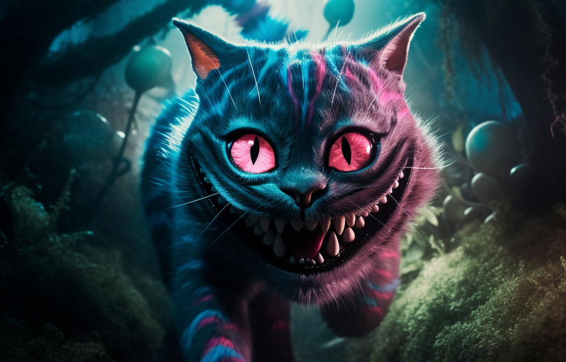

## Welcome dear!

This is where the Cheshire Cat AI is growing a long tail.
You will find several repos:

- [core](https://github.com/cheshire-cat-ai/core) is the backend to host your AI
- [admin-vue](https://github.com/cheshire-cat-ai/admin-vue) is the admin panel
- [widget-vue](https://github.com/cheshire-cat-ai/widget-vue) is the chat widget to put on your website
- [docs](https://github.com/cheshire-cat-ai/docs) is the official technical documentation

To know more:

- [Website](https://cheshirecat.ai/)
- [Documentation](https://cheshire-cat-ai.github.io/docs/)
- Join the [Discord community](https://discord.gg/bHX5sNFCYU)

*Image generated with MidJourney, prompted by [Edgars Romanovskis](https://www.linkedin.com/in/edgars-romanovskis-b28826259/)*

